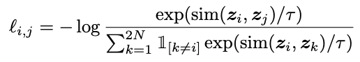
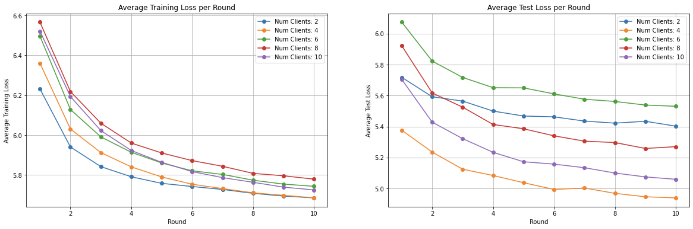
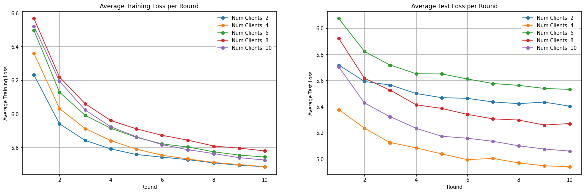

# PyTorch Federated Self-Supervised Learning

Self-supervised learning(SSL) is a learning paradigm that provides supervisory signals when learning from large-scale and unlabeled datasets by generating its own pseudo-labels, avoiding the need for ground-truth annotations. It's gained signifiigant traction in fields like computer vision and natual language processing that have vast collections of unlabeled data. In particular, contrastive learning (a discriminative method) has recently gained traction in SSL, particularly in pretext tasks like repsentation learning. 

Contrastive methods that employ data augmentations generate positive pairs of data by transforming each of their inputs to generate 'augmented' inputs that have different vector values but inherently convey the same information. Negative pairs can be  The contrastuve loss function encoourages similarity between model outputs of positive pairs and encourages dissimilarity between negative data pairs.

In this example, we implement SimCLR: A Simple Framework for Contrastive Learning of Visual Representations. SimCLR makes use of image augmentations(random croppings, adding gausian noise, horizontal inversions, etc.) to generate positively paired augmented data, and negative pairs are made between augmented data with different source images. The nromalized temperatre-scaled cross entropy (NT-Xent) loss function below encourages similarity between positive pairs and disimilarity between negative pairs, where cosine similarity is used to compute similaroty between the representation latent vectors. The NT-Xent loss is shown below:

<p align="center">
  
</p>

In short, SimCLR consists of an encoder network - in our case we use ResNet50/ResNet18 - and a projection head which projects encoded representations to a lower dimensional space where the contrastive loss is applied.


## Environment Setup

Start by cloning the code example. We prepared a single-line command that you can copy into your shell which will checkout the example for you:

```shell
git clone --depth=1 https://github.com/adap/flower.git && mv flower/examples/pytorch-federeated-self-supervised . && rm -rf flower && cd pytorch-federeated-self-supervised
```

This will create a new directory called `pytorch-federeated-self-supervised` containing the following files:

```
-- README.md           <- Your're reading this right now
-- main.py             <- Start federated simulation
-- client.py           <- Flower client constructor
-- model.py            <- Contains models and contrastive loss
-- utils.py            <- Utility functions (data loading, simulation settings)
-- test.py             <- Fine-tune and test pre-trained model
-- app.py              <- ServerApp/ClientApp for Flower-Next
-- conf/config.yaml    <- Configuration file
-- requirements.txt    <- Example dependencies
```


### Installing dependencies

Project dependencies are defined in `requirements.txt`. Install them with:

```shell
pip install -r requirements.txt
```

### Run with `start_simulation()`

Ensure you have activated your environment then:

```bash
# and then run the example
python main.py
```

You can adjust the CPU/GPU resources you assign to your similation, as well as the number of clients and rounds for local training. 

```bash
# Will assign 2xCPUs to the simulation
python main.py --num_cpus=2

# Will assign 2xCPUs and 25% of the GPU's to the simulation
python main.py --num_cpus=2 --num_gpus=0.25

# Set
python main.py  --num_clients=5

## Run with Flower Next (preview)

We conduct a 2-client setting to demonstrate how to run federated LLM fine-tuning with Flower Next.
Please follow the steps below:

1. Start the long-running Flower server (SuperLink)
   ```bash
   flower-superlink --insecure
   ```
2. Start the long-running Flower client (SuperNode)
   ```bash
   # In a new terminal window, start the first long-running Flower client:
   flower-client-app app:client1 --insecure
   ```
   ```bash
   # In another new terminal window, start the second long-running Flower client:
   flower-client-app app:client2 --insecure
   ```
3. Run the Flower App
   ```bash
   # With both the long-running server (SuperLink) and two clients (SuperNode) up and running,
   # we can now run the actual Flower App:
   flower-server-app app:server --insecure
   ```


## Expected Results

<p align="center">
  
</p>



*Will Add to the results, explain manner in which SSL encoder was trained with projection head, and will explain supervised finetuning after FL rounds* 

The graphs above show average client loss values over rounds during local training and evaluation. A classiifcation accuracy of 76.8% was achieved when training the SimCLR encoder model for 7 rounds over 5 clients in a self-supervised manner, after which a linear predictor was stacked upon the encoder and fine-tuned for 20 epochs on 10 percent of the training dataset in a supervised manner.
