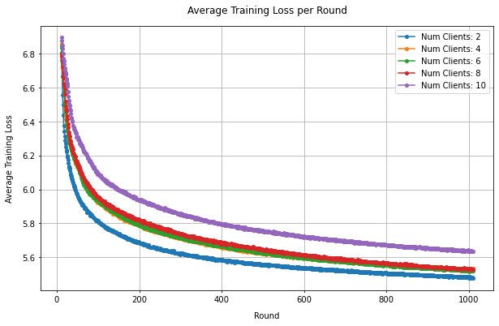

# Federated Self-Supervised Learning for Image Domain

Self-supervised learning (SSL) is a learning paradigm that provides supervisory signals when learning from large-scale and unlabeled datasets by generating synthetic pseudo-labels - thus avoiding the need for ground-truth annotations. It's gained signifigant traction in fields like computer vision, NLP, and audio signal processing that have vast collections of unlabeled data. Contrastive learning (a discriminative method) has recently gained traction in SSL, particularly for pretext tasks like repsentation learning. 

Contrastive methods that employ data augmentations generate positive pairs of data by transforming each of their inputs to generate 'augmented' inputs that have modified vector values but inherently convey the same information. Negative pairs can be made by pairing data with the intention of highlighting the difference, or "contrast", between the two negatively paired inputs. The contrastive loss function(shown below) encourages similarity between model outputs of positive pairs and encourages dissimilarity between negative data pairs.

<p align="center">
  
</p>


In this example, we implement SimCLR: A Simple Framework for Contrastive Learning of Visual Representations. SimCLR makes use of image augmentations(random croppings, adding gausian noise, horizontal inversions, etc.) to generate positively paired data, where positive pairs result from different random augmentations of the same image. Here, negative pairs are made between images transformed from different source images. The noromalized temperatre-scaled cross entropy (NT-Xent) loss function above encourages similarity between positive pairs and disimilarity between negative pairs, where cosine similarity is used to compute similarity between the latent representation vectors.


In short, SimCLR consists of an encoder network - in our case we use ResNet50 - and a projection head which projects encoded representations to a lower dimensional space where the contrastive loss is applied.


## Environment Setup

Start by cloning the code example. We prepared a single-line command that you can copy into your shell which will checkout the example for you:

```shell
git clone --depth=1 https://github.com/adap/flower.git && mv flower/examples/pytorch-federeated-self-supervised . && rm -rf flower && cd pytorch-federeated-self-supervised
```

This will create a new directory called `pytorch-federeated-self-supervised-learning` containing the following files:

```
-- README.md           <- Your're reading this right now
-- main.py             <- Start federated simulation
-- client.py           <- Flower client constructor
-- model.py            <- Contains models and contrastive loss
-- utils.py            <- Utility functions (data loading, simulation settings)
-- test.py             <- Fine-tune and test pre-trained model
-- app.py              <- ServerApp/ClientApp for Flower-Next
-- conf/config.yaml    <- Configuration file
-- requirements.txt    <- Example dependencies
```


### Installing dependencies

Project dependencies are defined in `pyproject.toml`. Install them with:

```shell
pip install -e .
```

## Run the project

You can run your Flower project in both _simulation_ and _deployment_ mode without making changes to the code. If you are starting with Flower, we recommend you using the _simulation_ mode as it requires fewer components to be launched manually. By default, `flwr run` will make use of the Simulation Engine.

### Run with the Simulation Engine

```bash
flwr run .
```

### Run with the Deployment Engine

> \[!NOTE\]
> An update to this example will show how to run this Flower application with the Deployment Engine and TLS certificates, or with Docker.


## Expected Results

<p align="center">
  
</p>


*Will Add to the results, explain manner in which SSL encoder was trained with projection head, and will explain supervised finetuning after FL rounds* 

The graphs above show average client loss values over rounds during local training and evaluation. A classifcation accuracy of 76.8% was achieved when training the SimCLR encoder model for 7 rounds over 5 clients with SSL, after which a linear predictor was stacked upon the encoder and fine-tuned for 20 epochs on 10 percent of the training dataset in a supervised manner.
